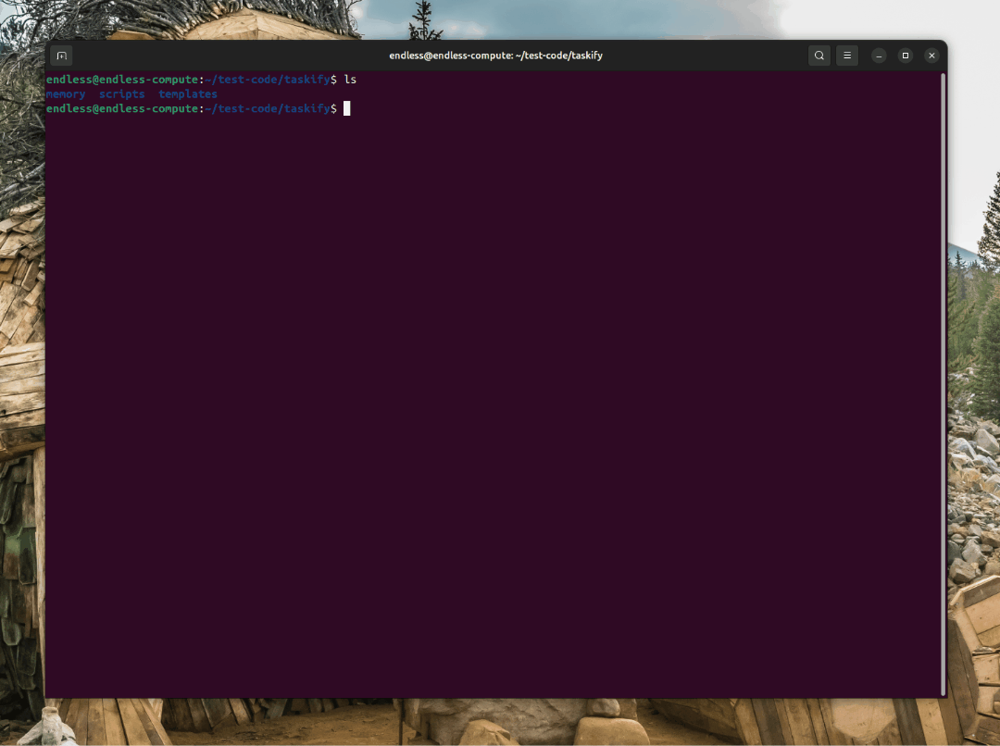

<div align="center">
    
    <h1>🌱 Spec Kit CN</h1>
    <h3><em>更快地构建高质量软件。</em></h3>
</div>

<p align="center">
    <strong>这是一项旨在帮助组织专注于产品场景而非编写无差异化代码的努力，借助规范驱动开发（Spec-Driven Development）的力量。</strong>
</p>

<div align="center">

[](https://github.com/Linfee/spec-kit-cn/actions/workflows/release.yml)
[](https://github.com/Linfee/spec-kit-cn.git)
[](https://github.com/Linfee/spec-kit-cn/releases)

</div>

> **💡 这是 [GitHub Spec Kit](https://github.com/github/spec-kit) 的官方中文复刻版本**
> **🔄 对应原版提交**: [`bfeb40cebc6f1d08cf055e19433967d3328a522c`](https://github.com/github/spec-kit/commit/bfeb40cebc6f1d08cf055e19433967d3328a522c)
> **📦 包名**: `specify-cn-cli` | **🛠️ 命令**: `specify-cn`

---

## 🎯 版本信息

### 🚀 当前版本

- **中文版本**: [`specify-cn-cli v0.0.4`](https://github.com/Linfee/spec-kit-cn/releases/tag/v0.0.4)
- **命令行工具**: `specify-cn`
- **依赖管理**: `uv run specify-cn`

### 🔄 版本对应关系

| Spec Kit CN | 对应原版 Spec Kit | 提交 ID |
|-------------|----------------------|-------------|
| **v0.0.4** | 最新版本 | [`bfeb40cebc6f1d08cf055e19433967d3328a522c`](https://github.com/github/spec-kit/commit/bfeb40cebc6f1d08cf055e19433967d3328a522c) |

> **⚠️ 保持同步**: 本项目将定期与原版保持同步，确保中文用户能够享受最新的功能和改进。

### 🎯 差异说明

| 项目 | Spec Kit原版 | Spec Kit CN中文版 |
|--------|-----------------|---------------------|
| 命令 | `specify` | `specify-cn` |
| 包名 | `specify-cli` | `specify-cn-cli` |
| 文档 | 英文 | 中文 |
| 依赖管理 | pip/pipx | uv |

---

## 目录

- [🎯 版本信息](#-版本信息)
- [🤔 什么是规范驱动开发？](#-什么是规范驱动开发)
- [⚡ 快速开始](#-快速开始)
- [📚 核心理念](#-核心理念)
- [🌟 开发阶段](#-开发阶段)
- [🎯 实验目标](#-实验目标)
- [🔧 前置要求](#-前置要求)
- [📖 了解更多](#-了解更多)
- [📋 详细流程](#-详细流程)
- [🔍 故障排除](#-故障排除)
- [👥 维护者](#-维护者)
- [💬 支持](#-支持)
- [🙏 致谢](#-致谢)
- [📄 许可证](#-许可证)

## 🤔 什么是规范驱动开发？

规范驱动开发**彻底改变**了传统软件开发的方式。几十年来，代码一直占据主导地位——规范只是我们在编码"真正工作"开始时构建和丢弃的脚手架。规范驱动开发改变了这一点：**规范变得可执行**，直接生成可工作的实现，而不仅仅是指导它们。

## ⚡ 快速开始

### 1. 安装 Specify CN

使用中文版本的编码代理初始化项目：

```bash
uvx --from git+https://github.com/Linfee/spec-kit-cn.git specify-cn init <PROJECT_NAME>
```

> **🎯 原版用户请注意**: 如果您希望使用英文原版，请访问 [github/spec-kit](https://github.com/github/spec-kit)

### 2. 创建规范

使用 `/specify` 命令描述您想要构建的内容。专注于**做什么**和**为什么**，而不是技术栈。

```bash
/specify 构建一个可以帮助我将照片整理到不同相册中的应用程序。相册按日期分组，可以通过在主页上拖拽来重新组织。相册不会嵌套在其他相册中。在每个相册内，照片以瓷砖界面预览。
```

### 3. 创建技术实施计划

使用 `/plan` 命令提供您的技术栈和架构选择。

```bash
/plan 应用程序使用Vite和最少数量的库。尽可能使用纯HTML、CSS和JavaScript。图片不会上传到任何地方，元数据存储在本地SQLite数据库中。
```

### 4. 分解和实施

使用 `/tasks` 创建可操作的任务列表，然后让您的代理实现该功能。

详细的分步说明，请参阅我们的[综合指南](./spec-driven.md)。

## 📚 核心理念

规范驱动开发是一个强调以下方面的结构化过程：

- **意图驱动开发**，规范在"如何"之前定义"什么"
- **丰富的规范创建**，使用护栏和组织原则
- **多步细化**，而不是从提示一次性生成代码
- **高度依赖**高级AI模型能力进行规范解释

## 🌟 开发阶段

| 阶段 | 重点 | 关键活动 |
|-------|-------|----------------|
| **0到1开发**（"绿地"） | 从头生成 | <ul><li>从高层需求开始</li><li>生成规范</li><li>规划实施步骤</li><li>构建生产就绪的应用程序</li></ul> |
| **创意探索** | 并行实现 | <ul><li>探索多样化的解决方案</li><li>支持多种技术栈和架构</li><li>实验UX模式</li></ul> |
| **迭代增强**（"棕地"） | 棕地现代化 | <ul><li>迭代添加功能</li><li>现代化遗留系统</li><li>适应流程</li></ul> |

## 🎯 实验目标

我们的研究和实验专注于：

### 技术独立性

- 使用多样化的技术栈创建应用程序
- 验证规范驱动开发是一个不依赖于特定技术、编程语言或框架的过程

### 企业约束

- 展示关键任务应用程序开发
- 融入组织约束（云提供商、技术栈、工程实践）
- 支持企业设计系统和合规要求

### 以用户为中心的开发

- 为不同用户群体和偏好构建应用程序
- 支持各种开发方法（从氛围编码到AI原生开发）

### 创意和迭代过程

- 验证并行实现探索的概念
- 提供强大的迭代功能开发工作流
- 扩展流程以处理升级和现代化任务

## 🔧 前置要求

- **Linux/macOS**（或Windows上的WSL2）
- AI编码代理：[Claude Code](https://www.anthropic.com/claude-code)、[GitHub Copilot](https://code.visualstudio.com/) 或 [Gemini CLI](https://github.com/google-gemini/gemini-cli)
- [uv](https://docs.astral.sh/uv/) 用于包管理
- [Python 3.11+](https://www.python.org/downloads/)
- [Git](https://git-scm.com/downloads)

## 📖 了解更多

- **[完整的规范驱动开发方法论](./spec-driven.md)** - 深入了解完整流程
- **[详细演练](#-详细流程)** - 分步实施指南

---

## 📋 详细流程

<details>
<summary>点击展开详细的分步演练</summary>

您可以使用Specify CLI来引导您的项目，这将在您的环境中引入所需的工件。运行：

```bash
specify init <project_name>
```

或在当前目录初始化：

```bash
specify init --here
```


系统会提示您选择正在使用的AI代理。您也可以直接在终端中主动指定：

```bash
specify init <project_name> --ai claude
specify init <project_name> --ai gemini
specify init <project_name> --ai copilot
# 或在当前目录：
specify init --here --ai claude
```

CLI会检查您是否安装了Claude Code或Gemini CLI。如果您没有安装，或者您希望在不检查正确工具的情况下获取模板，请在命令中使用 `--ignore-agent-tools`：

```bash
specify init <project_name> --ai claude --ignore-agent-tools
```

### **步骤1：** 引导项目

转到项目文件夹并运行您的AI代理。在我们的示例中，我们使用 `claude`。



如果您看到 `/specify`、`/plan` 和 `/tasks` 命令可用，就说明配置正确。

第一步应该是创建新的项目脚手架。使用 `/specify` 命令，然后为您想要开发的项目提供具体需求。

>[!IMPORTANT]
>尽可能明确地说明您要构建的_什么_和_为什么_。**此时不要关注技术栈**。

示例提示：

```text
开发Taskify，一个团队生产力平台。它应该允许用户创建项目、添加团队成员、
分配任务、评论并以看板风格在板之间移动任务。在此功能的初始阶段，
我们称之为"创建Taskify"，我们将有多个用户，但用户将提前预定义。
我想要两个不同类别的五个用户，一个产品经理和四个工程师。让我们创建三个
不同的示例项目。让我们为每个任务的状态使用标准的看板列，如"待办"、
"进行中"、"审核中"和"已完成"。此应用程序将没有登录，因为这只是
确保我们基本功能设置的第一次测试。对于UI中的任务卡片，
您应该能够在看板工作板的不同列之间更改任务的当前状态。
您应该能够为特定卡片留下无限数量的评论。您应该能够从该任务
卡片中分配一个有效用户。当您首次启动Taskify时，它会给您一个五个用户的列表供您选择。
不需要密码。当您点击用户时，您进入主视图，显示项目列表。
当您点击项目时，您会打开该项目的看板。您将看到列。
您将能够在不同列之间来回拖放卡片。您将看到分配给您的任何卡片，
即当前登录用户，与其他卡片颜色不同，以便您快速看到您的卡片。
您可以编辑您所做的任何评论，但不能编辑其他人所做的评论。您可以
删除您所做的任何评论，但不能删除其他人所做的评论。
```

输入此提示后，您应该看到Claude Code启动规划和规范起草过程。Claude Code还将触发一些内置脚本来设置仓库。

完成此步骤后，您应该有一个新创建的分支（例如，`001-create-taskify`），以及 `specs/001-create-taskify` 目录中的新规范。

生成的规范应包含一组用户故事和功能需求，如模板中所定义。

在此阶段，您的项目文件夹内容应类似于以下内容：

```text
├── memory
│	 ├── constitution.md
│	 └── constitution_update_checklist.md
├── scripts
│	 ├── check-task-prerequisites.sh
│	 ├── common.sh
│	 ├── create-new-feature.sh
│	 ├── get-feature-paths.sh
│	 ├── setup-plan.sh
│	 └── update-claude-md.sh
├── specs
│	 └── 001-create-taskify
│	     └── spec.md
└── templates
    ├── CLAUDE-template.md
    ├── plan-template.md
    ├── spec-template.md
    └── tasks-template.md
```

### **步骤2：** 功能规范澄清

有了基线规范后，您可以继续澄清在第一次尝试中未正确捕获的任何需求。例如，您可以在同一个Claude Code会话中使用这样的提示：

```text
对于您创建的每个示例项目或项目，每个项目应该有5到15个之间的可变数量任务，
随机分布到不同的完成状态。确保每个完成阶段至少有一个任务。
```

您还应该要求Claude Code验证**审核和验收清单**，勾选验证/通过要求的项目，未通过的项目保持未勾选状态。可以使用以下提示：

```text
阅读审核和验收清单，如果功能规范符合标准，请勾选清单中的每个项目。如果不符合，请留空。
```

重要的是，要将与Claude Code的互动作为澄清和围绕规范提问的机会——**不要将其第一次尝试视为最终版本**。

### **步骤3：** 生成计划

您现在可以具体说明技术栈和其他技术要求。您可以使用项目模板中内置的 `/plan` 命令，使用这样的提示：

```text
我们将使用.NET Aspire生成这个，使用Postgres作为数据库。前端应该使用
Blazor服务器与拖拽任务板、实时更新。应该创建一个REST API，包含项目API、
任务API和通知API。
```

此步骤的输出将包括许多实施细节文档，您的目录树类似于：

```text
.
├── CLAUDE.md
├── memory
│	 ├── constitution.md
│	 └── constitution_update_checklist.md
├── scripts
│	 ├── check-task-prerequisites.sh
│	 ├── common.sh
│	 ├── create-new-feature.sh
│	 ├── get-feature-paths.sh
│	 ├── setup-plan.sh
│	 └── update-claude-md.sh
├── specs
│	 └── 001-create-taskify
│	     ├── contracts
│	     │	 ├── api-spec.json
│	     │	 └── signalr-spec.md
│	     ├── data-model.md
│	     ├── plan.md
│	     ├── quickstart.md
│	     ├── research.md
│	     └── spec.md
└── templates
    ├── CLAUDE-template.md
    ├── plan-template.md
    ├── spec-template.md
    └── tasks-template.md
```

检查 `research.md` 文档，确保根据您的说明使用了正确的技术栈。如果任何组件突出显示，您可以要求Claude Code完善它，甚至让它检查您想要使用的平台/框架的本地安装版本（例如，.NET）。

此外，如果您选择的技术栈是快速变化的（例如，.NET Aspire、JS框架），您可能想要要求Claude Code研究有关所选技术栈的详细信息，使用这样的提示：

```text
我希望您查看实施计划和实施细节，寻找可能从额外研究中受益的领域，
因为.NET Aspire是一个快速变化的库。对于您识别的需要进一步研究的那些领域，
我希望您使用有关我们将在Taskify应用程序中使用的特定版本的额外详细信息更新研究文档，
并启动并行研究任务，使用网络研究澄清任何细节。
```

在此过程中，您可能会发现Claude Code卡在研究错误的内容——您可以使用这样的提示帮助它朝着正确的方向推进：

```text
我认为我们需要将其分解为一系列步骤。首先，识别您在实施期间需要做的不确定
或从进一步研究中受益的任务列表。写下这些任务的列表。然后对于这些任务中的每一个，
我希望您启动一个单独的研究任务，这样最终结果是我们并行研究所有这些非常具体的任务。
我看到您所做的是看起来您在研究.NET Aspire一般情况，我认为这对我们不会有太大帮助。
那太没有针对性的研究了。研究需要帮助您解决特定的针对性问题。
```

>[!NOTE]
>Claude Code可能过于急切，添加您没有要求的组件。要求它澄清变更的理由和来源。

### **步骤4：** 让Claude Code验证计划

有了计划后，您应该让Claude Code检查它，确保没有遗漏的部分。您可以使用这样的提示：

```text
现在我希望您去审核实施计划和实施细节文件。
带着确定是否存在从阅读中可以明显看出的您需要做的一系列任务的眼光来阅读。
因为我不确定这里是否足够。例如，当我查看核心实施时，参考实施细节中的适当位置
会很有用，以便在它执行核心实施或细化中的每个步骤时可以找到信息。
```

这有助于完善实施计划，并帮助您避免Claude Code在其规划周期中遗漏的潜在盲点。一旦初始细化完成，在您可以进入实施之前，要求Claude Code再次检查清单。

您也可以要求Claude Code（如果您安装了[GitHub CLI](https://docs.github.com/en/github-cli/github-cli)）继续从您当前的分支向 `main` 创建一个详细描述的pull request，以确保工作得到正确跟踪。

>[!NOTE]
>在让代理实施之前，还值得提示Claude Code交叉检查细节，看看是否有任何过度设计的部分（记住——它可能过于急切）。如果存在过度设计的组件或决策，您可以要求Claude Code解决它们。确保Claude Code遵循[宪法](base/memory/constitution.md)作为建立计划时必须遵守的基础。

### 步骤5：实施

准备就绪后，指示Claude Code实施您的解决方案（包含示例路径）：

```text
implement specs/002-create-taskify/plan.md
```

Claude Code将立即行动并开始创建实施。

>[!IMPORTANT]
>Claude Code将执行本地CLI命令（如 `dotnet`）——确保您在机器上安装了它们。

实施步骤完成后，要求Claude Code尝试运行应用程序并解决任何出现的构建错误。如果应用程序运行，但有Claude Code无法通过CLI日志直接获得的_运行时错误_（例如，浏览器日志中呈现的错误），请将错误复制粘贴到Claude Code中并让它尝试解决。

</details>

---

## 🔍 故障排除

### Linux上的Git凭据管理器

如果您在Linux上遇到Git身份验证问题，可以安装Git凭据管理器：

```bash
#!/usr/bin/env bash
set -e
echo "正在下载Git凭据管理器v2.6.1..."
wget https://github.com/git-ecosystem/git-credential-manager/releases/download/v2.6.1/gcm-linux_amd64.2.6.1.deb
echo "正在安装Git凭据管理器..."
sudo dpkg -i gcm-linux_amd64.2.6.1.deb
echo "正在配置Git使用GCM..."
git config --global credential.helper manager
echo "正在清理..."
rm gcm-linux_amd64.2.6.1.deb
```

## 👥 维护者

- Den Delimarsky ([@localden](https://github.com/localden))
- John Lam ([@jflam](https://github.com/jflam))

## 💬 支持

如需支持，请打开[GitHub issue](https://github.com/Linfee/spec-kit/issues/new)。我们欢迎错误报告、功能请求和关于使用规范驱动开发的问题。

## 🙏 致谢

这个项目深受[John Lam](https://github.com/jflam)的工作和研究的影响并基于其成果。

## 📄 许可证

本项目根据MIT开源许可证的条款授权。请参阅[LICENSE](./LICENSE)文件了解完整条款。