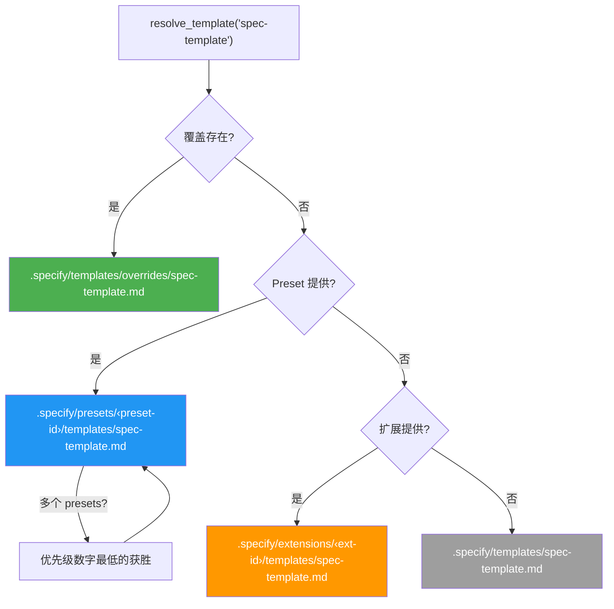
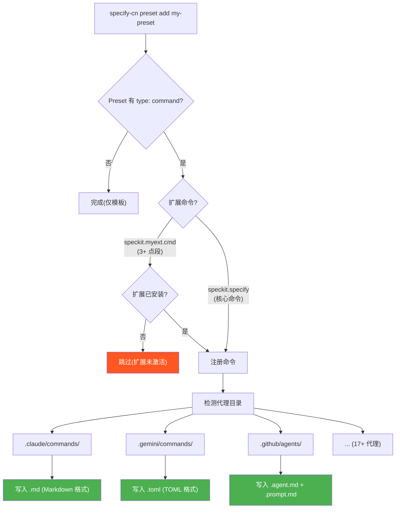
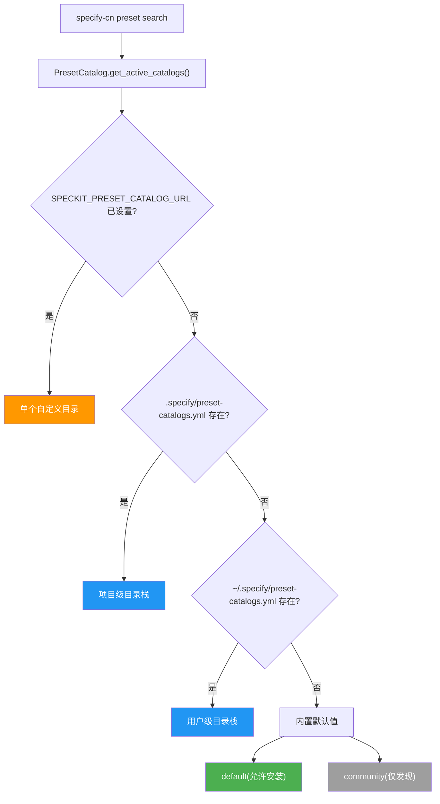

# Preset 系统架构

本文档描述 preset 系统的内部架构 — 模板解析, 命令注册和目录管理在底层是如何工作的.

有关使用说明, 请参阅 [README.md](README.md).

## 模板解析

当 Spec Kit 需要模板(例如 `spec-template`)时, `PresetResolver` 遍历优先级栈并返回第一个匹配项:



| 优先级 | 来源 | 路径 | 使用场景 |
|--------|------|------|----------|
| 1 (最高) | 覆盖 | `.specify/templates/overrides/` | 一次性项目本地调整 |
| 2 | Preset | `.specify/presets/<id>/templates/` | 可共享, 可堆叠的自定义 |
| 3 | 扩展 | `.specify/extensions/<id>/templates/` | 扩展提供的模板 |
| 4 (最低) | 核心 | `.specify/templates/` | 附带的默认值 |

当安装了多个 presets 时, 它们按 `priority` 字段排序(数字越小 = 优先级越高). 这是通过 `specify-cn preset add` 上的 `--priority` 设置的.

解析被实现了三次以确保一致性:
- **Python**: `src/specify_cli/presets.py` 中的 `PresetResolver`
- **Bash**: `scripts/bash/common.sh` 中的 `resolve_template()`
- **PowerShell**: `scripts/powershell/common.ps1` 中的 `Resolve-Template`

## 命令注册

当安装带有 `type: "command"` 条目的 preset 时, `PresetManager` 使用 `src/specify_cli/agents.py` 中的共享 `CommandRegistrar` 将它们注册到所有检测到的代理目录.



### 扩展安全检查

命令名称遵循模式 `speckit.<ext-id>.<cmd-name>`. 当命令有 3+ 个点段时, 系统提取扩展 ID 并检查 `.specify/extensions/<ext-id>/` 是否存在. 如果扩展未安装, 命令会被跳过 — 防止引用不存在扩展的孤立文件.

核心命令(例如 `speckit.specify`, 只有 2 个段)总是会被注册.

### 代理格式渲染

`CommandRegistrar` 为每个代理以不同方式渲染命令:

| 代理 | 格式 | 扩展名 | 参数占位符 |
|------|------|--------|------------|
| Claude, Cursor, opencode, Windsurf 等 | Markdown | `.md` | `$ARGUMENTS` |
| Copilot | Markdown | `.agent.md` + `.prompt.md` | `$ARGUMENTS` |
| Gemini, Qwen, Tabnine | TOML | `.toml` | `{{args}}` |

### 移除时清理

当调用 `specify-cn preset remove` 时, 已注册的命令从注册表元数据中读取, 相应的文件从每个代理目录中删除, 包括 Copilot 的配套 `.prompt.md` 文件.

## 目录系统



目录以 1 小时缓存获取(每个 URL, SHA256 哈希缓存文件). 每个目录条目有一个 `priority`(用于合并排序)和 `install_allowed` 标志.

## 仓库布局

```
presets/
├── ARCHITECTURE.md                         # 本文件
├── PUBLISHING.md                           # 提交 presets 到目录的指南
├── README.md                               # 用户指南
├── catalog.json                            # 官方 preset 目录
├── catalog.community.json                  # 社区 preset 目录
├── scaffold/                               # 创建新 presets 的脚手架
│   ├── preset.yml                          # 示例清单
│   ├── README.md                           # 自定义脚手架的指南
│   ├── commands/
│   │   ├── speckit.specify.md              # 核心命令覆盖示例
│   │   └── speckit.myext.myextcmd.md       # 扩展命令覆盖示例
│   └── templates/
│       ├── spec-template.md                # 核心模板覆盖示例
│       └── myext-template.md               # 扩展模板覆盖示例
└── self-test/                              # 自测 preset(覆盖所有核心模板)
    ├── preset.yml
    ├── commands/
    │   └── speckit.specify.md
    └── templates/
        ├── spec-template.md
        ├── plan-template.md
        ├── tasks-template.md
        ├── checklist-template.md
        ├── constitution-template.md
        └── agent-file-template.md
```

## 模块结构

```
src/specify_cli/
├── agents.py       # CommandRegistrar — 将命令文件写入代理目录的
│                    #   共享基础设施
├── presets.py       # PresetManifest, PresetRegistry, PresetManager,
│                    #   PresetCatalog, PresetCatalogEntry, PresetResolver
└── __init__.py      # CLI 命令: specify-cn preset list/add/remove/search/
                     #   resolve/info, specify-cn preset catalog list/add/remove
```
